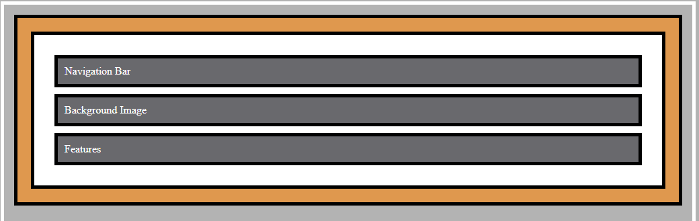
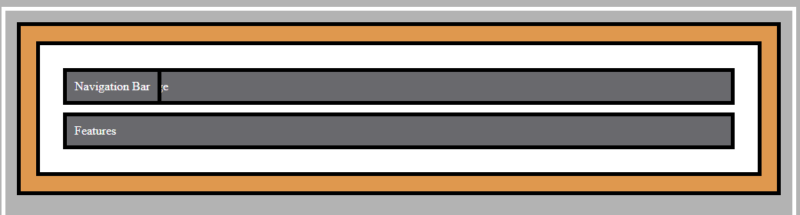
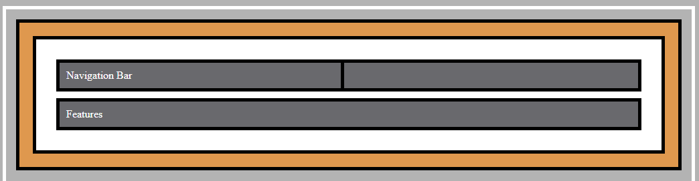
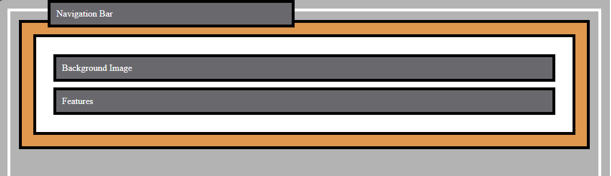
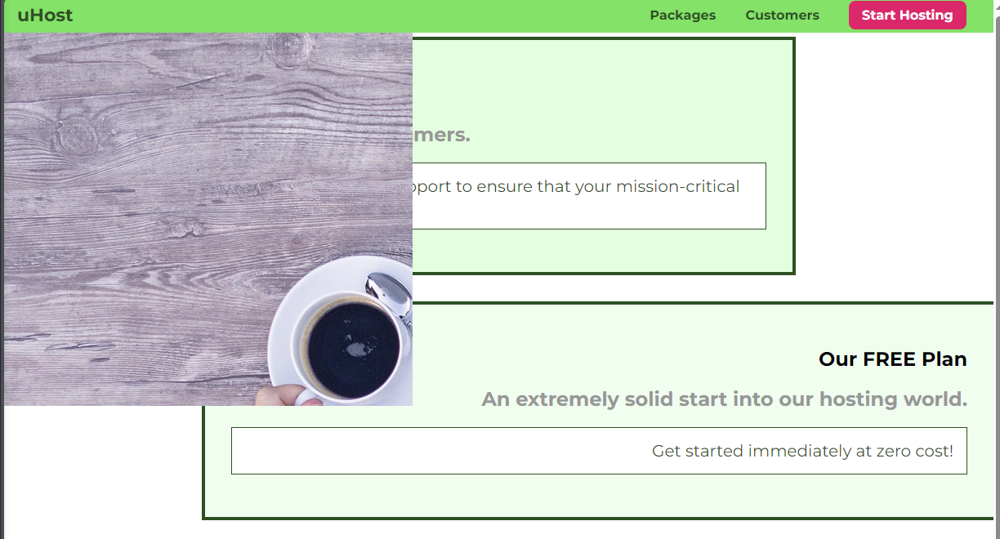
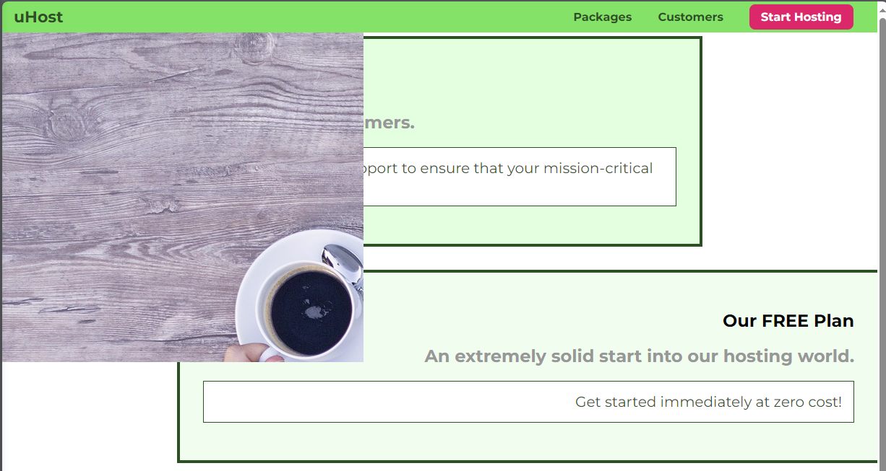
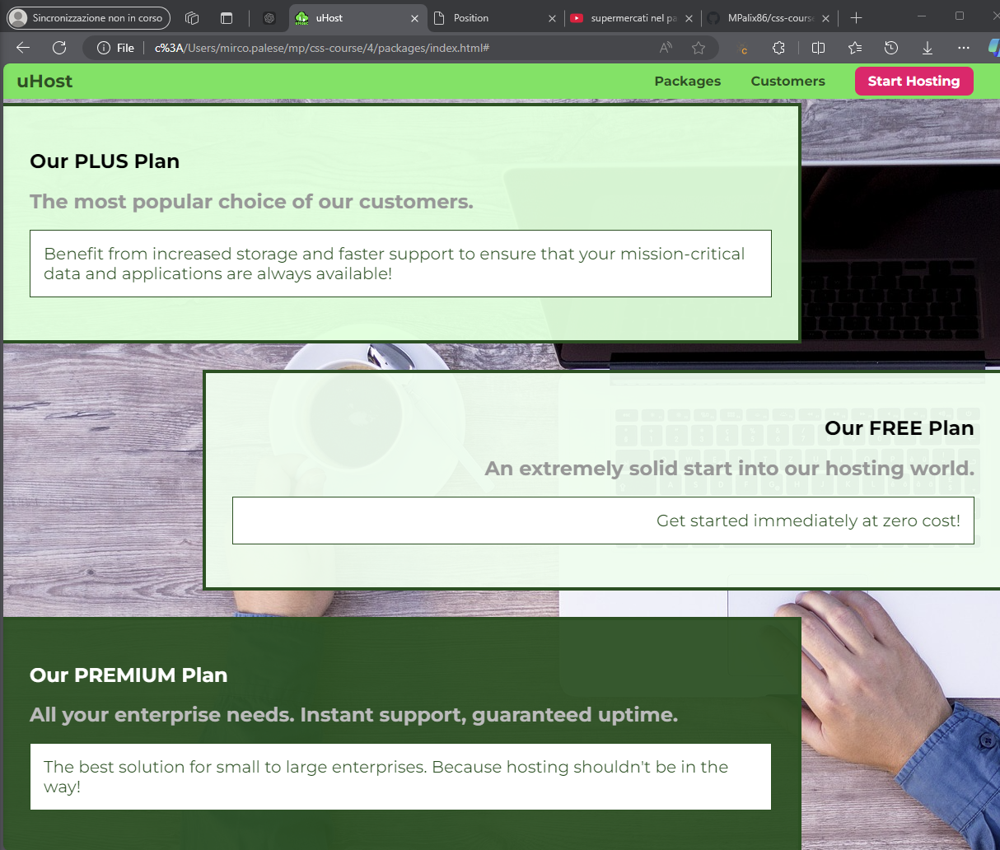
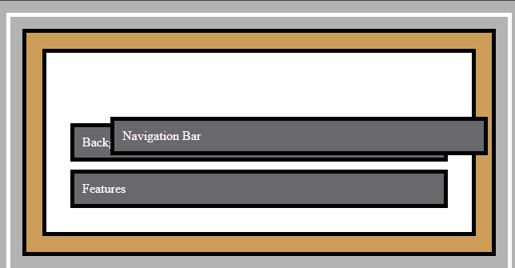
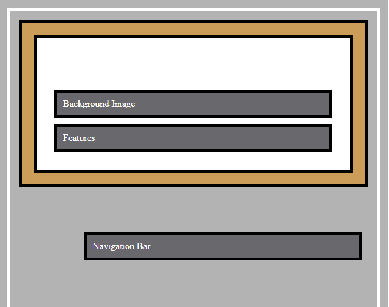
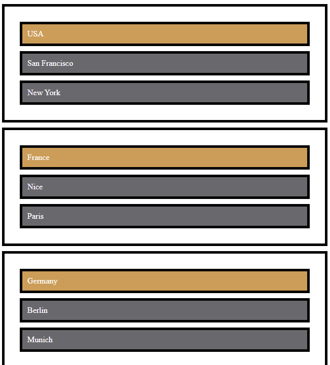

# Box Model

ogni elemnto in css è interpretato come un box e noi possiamo vedere questo box e le sue proprieta principali aprendo lo strumento di sviluppo


ogni elmento ha un `content` che è blu e poi ha il `padding` il `border` e il `margin`

## margin collapsing


questo è il comportamento che css ha con i margini: ovvero se ci sono 2 elementi che hanno margini e sono uno adiacente all'altro , verra considerato solo il margine piu grande! CSS fa Questo per far si che non ci siano troppo spazi vuoti. In generale valgono :

- Fratelli adiacenti: Quando due elementi con margini sono adiacenti, il margine maggiore tra i due viene applicato tra gli elementi.
- Genitore con figli: Il margine di un genitore può fondersi con il margine del primo e/o ultimo figlio, con il margine più grande che prevale, a meno che il genitore non abbia padding, bordo o contenuto inline.
- Elemento vuoto: Se un elemento non ha contenuto, padding, bordo o altezza, i margini superiori e inferiori si uniscono e viene applicato il margine più grande.

## height and width

come detto prima, tutti gli elementi sono box. Ci sono diversi modi in cui il browser può calcolare la larghezza e l'altezza di un box. Possiamo modificare il modo in cui calcola queste proprietà impostando la proprietà `box-sizing`.

Il valore di default è `box-sizing: content-box`, questo significa che il browser, nel calcolare larghezza e altezza, prenderà in considerazione solo il contenuto del box. Quindi, `padding`, `border` e `margin` saranno aggiunti alla larghezza e all'altezza calcolata.

Se usiamo invece `box-sizing: border-box`, il browser includerà il padding e il border nella larghezza e nell'altezza, ma non il margin. Questo è, di solito, il metodo di calcolo più conveniente da usare.

Dato che non è il comportamento di default, ma è di fatto il più utile, di solito abbiamo bisogno di impostarlo globalmente. Per fare questo, dobbiamo usare il selettore universale:

```css
* {
  box-sizing: border-box;
}
```

## Elementi Block inline e display

### Block

- Occupano l'intera larghezza disponibile.
- Iniziano su una nuova riga.
- Possono contenere sia altri elementi block che inline.

- **Esempi**: `<div>` `<p>` `<h1>` `<h2>` `<h3>` `<ul>` `<ol>` `<li>`

```html
<div>Questo è un elemento di blocco.</div>
<p>Questo è un paragrafo.</p>
<h1>Questo è un'intestazione.</h1>
```

### Inline

- Occupano solo lo spazio necessario al loro contenuto (quindi non è possibile impostare larghezza e altezza)
- Non iniziano su una nuova riga.
- Possono contenere solo altri elementi inline o testo.

- **Esempi**: `<a>` `<span>` `<strong>`, `<em>` ``, `<code>`

```html
<p>Questo è un paragrafo con un <a href="#">link</a> e del testo <strong>in grassetto</strong>.</p>
<p>Un'altra frase con del codice inline: <code>console.log('Hello World!')</code>.</p>
```

---

### Differenze Principali

| **Caratteristica**           | **Elementi Block**                    | **Elementi Inline**                           |
| ---------------------------- | ------------------------------------- | --------------------------------------------- |
| **Occupazione di spazio**    | Occupa l'intera larghezza disponibile | Occupa solo lo spazio necessario al contenuto |
| **Inizio su una nuova riga** | Sì                                    | No                                            |
| **Contenuto consentito**     | Può contenere block e inline          | Può contenere solo inline o testo             |
| **Esempi**                   | `<div>`, `<p>`, `<h1>`, `<ul>`        | `<a>`, `<span>`, `<strong>`, ``          |

### display

la Proprietà display di un elemnto è quella che ci permette di cambiare comportamento di un elemento block o inline

### Valori principali di `display`

1. **`block`**

   - L'elemento diventa un **block element**, occupa tutta la larghezza disponibile e inizia su una nuova riga.
   - Esempi: `<div>`, `<p>`, `<h1>`

2. **`inline`**

   - L'elemento diventa un **inline element**, occupa solo lo spazio necessario e rimane sulla stessa riga.
   - Esempi: `<span>`, `<a>`, `<strong>`

3. **`inline-block`**

   - Comporta l'elemento come un mix tra inline e block, permettendo di definire larghezza e altezza, non sposta toglie l'elemento dal normale flusso del documento.
     e non consente di specificare `left`, `right`, `top`, `bottom` ma solo di specificare `width` ed `height`
   - Esempio: Utilizzato per pulsanti o immagini in linea.

4. **`none`**

   - Nasconde completamente l'elemento, che non occupa spazio nel layout.
   - Esempio: Utile per menu o modali nascosti.

5. **`flex`**

   - Imposta l'elemento come un **contenitore flessibile** usando il modello di layout flexbox.
   - Esempio: Utilizzato per creare layout flessibili.

6. **`inline-flex`**

   - Simile a `flex`, ma l'elemento rimane inline, con i contenuti gestiti in modalità flessibile.

7. **`grid`**

   - Imposta l'elemento come un **contenitore a griglia**, con righe e colonne.
   - Esempio: Layout strutturati complessi.

8. **`inline-grid`**

   - Simile a `grid`, ma il contenitore principale resta inline.

9. **`table`**

   - Comporta l'elemento come una **tabella HTML**, con layout simile alle tabelle standard.
   - Esempio: Simulazione di tabelle senza `<table>`.

10. **`list-item`**

- L'elemento si comporta come un **elemento di lista** (`<li>`), con marker predefiniti (punti o numeri).
- Esempio: Usato per creare liste personalizzate.

We had a look at `display: none`
this value removes the element to which you apply it from the document flow. This means that the element is not visible and it also doesn't "block its position". Other elements can (and will) take its place instead.

There is an alternative to that though.

If you only want to hide an element but you want to keep its place (i.e. other elements don't fill the empty spot), you can use

`visibility: hidden`

---

# pseudo classi

permettono di definire lo stile di un elemento durante degli stati 'speciali'
di quello stesso elemento:
vengono aggiunte tramite l'operatore `:`

```css
a:hover {
  color: blue;
}
```

**altre pseudo classi**

1. **`:hover`**

   - Applica uno stile quando il cursore è sopra l'elemento.
   - _Esempio_: `a:hover { color: red; }`

2. **`:active`**

   - Applica uno stile mentre l'elemento è attivamente selezionato (es. clic).
   - _Esempio_: `button:active { background-color: blue; }`

3. **`:focus`**

   - Applica uno stile quando un elemento ha il focus.
   - _Esempio_: `input:focus { border: 2px solid green; }`

4. **`:visited`**

   - Stile per i link già visitati.
   - _Esempio_: `a:visited { color: purple; }`

5. **`:first-child`**

   - Seleziona il primo figlio di un elemento.
   - _Esempio_: `p:first-child { font-weight: bold; }`

6. **`:last-child`**

   - Seleziona l'ultimo figlio di un elemento.
   - _Esempio_: `li:last-child { margin-bottom: 0; }`

7. **`:nth-child(n)`**

   - Seleziona un elemento in base alla sua posizione.
   - _Esempio_: `li:nth-child(2n) { background-color: lightgrey; }`

8. **`:not(selector)`**

   - Seleziona un elemento che non corrisponde al selettore specificato.
   - _Esempio_: `div:not(.active) { opacity: 0.5; }`

9. **`:checked`**

   - Seleziona input (checkbox o radio) selezionati.
   - _Esempio_: `input[type="checkbox"]:checked { background-color: yellow; }`

10. **`:disabled`**

    - Seleziona input disabilitati.
    - _Esempio_: `input:disabled { background-color: grey; }`

11. **`:enabled`**

    - Seleziona input abilitati.
    - _Esempio_: `input:enabled { background-color: white; }`

12. **`:first-of-type`**

    - Seleziona il primo elemento del suo tipo in un genitore.
    - _Esempio_: `p:first-of-type { color: blue; }`

13. **`:last-of-type`**

    - Seleziona l'ultimo elemento del suo tipo in un genitore.
    - _Esempio_: `h2:last-of-type { color: red; }`

14. **`:nth-of-type(n)`**

    - Seleziona un elemento in base alla sua posizione tra elementi dello stesso tipo.
    - _Esempio_: `li:nth-of-type(2n) { background-color: lightblue; }`

15. **`:lang(language)`**

    - Seleziona elementi in base alla lingua specificata.
    - _Esempio_: `p:lang(en) { font-style: italic; }`

## pseudo elementi

- **pseudo elementi**
  permettono di definire lo stile di una specifica parte di un elemento.
  vengono aggiunte tramite l'operatore `: : `

  ```css
  p::first-line {
    color: blue;
  }
  ```

**altri pseudo elementi**

1. **`::before`**

   - Inserisce contenuto prima del contenuto dell'elemento.
   - _Esempio_:
     ```css
     p::before {
       content: 'Nota: ';
       font-weight: bold;
     }
     ```

2. **`::after`**

   - Inserisce contenuto dopo il contenuto dell'elemento.
   - _Esempio_:
     ```css
     p::after {
       content: ' [fine]';
     }
     ```

3. **`::first-line`**

   - Seleziona la prima riga di un blocco di testo per applicare stili specifici.
   - _Esempio_:
     ```css
     p::first-line {
       font-weight: bold;
     }
     ```

4. **`::first-letter`**

   - Seleziona la prima lettera di un blocco di testo per stili decorativi.
   - _Esempio_:
     ```css
     p::first-letter {
       font-size: 2em;
     }
     ```

5. **`::selection`**

   - Applica stili al testo selezionato dall'utente.
   - _Esempio_:
     ```css
     ::selection {
       background: yellow;
       color: black;
     }
     ```

6. **`::placeholder`**

   - Seleziona il testo segnaposto all'interno di un campo di input.
   - _Esempio_:
     ```css
     input::placeholder {
       color: grey;
       font-style: italic;
     }
     ```

7. **`::marker`**
   - Seleziona il marker di un elemento di lista (come i punti di un `<ul>`).
   - _Esempio_:
     ```css
     li::marker {
       color: red;
       font-weight: bold;
     }
     ```

<br  >

# position

con position cambiamo il _positioning context_ di un elemento,

come gia sappiamo il flusso del documento va dall'alto verso il basso, e se posizioniamo degli elementi nel documento questi si allineeranno dall'alto verso il basso seguendo il flusso del documento stesso.

ad esempio una pagina con la seguente struttura :

```html
<html>
  <body>
    <div></div>
    <div></div>
    <div></div>
  </body>
</html>
```

avra una forma del tipo :

.png>)

Tutto questo succede perche il browser di default apllica la proprieta `position : static`,

`position static` fa si che gli elementi seguano il normale flusso del documento e non ci permette di intervenire in alcun modo sul posizionamento dell'elemento tramite le prorpieta `left`, `right`, `top`, e `bottom`.

ma immaginiano di volere una situazione atipica


Dobbiamo notare due cose: la posizione del div è cambiata, ma le sue dimensioni e tutto il resto sono rimasti gli stessi. Questo perché **non** abbiamo alterato il flusso del documento, ovvero la struttura dell'HTML è rimasta la stessa. Quindi, le dimensioni del div vengono ancora calcolate in relazione al suo `parent`.

Fare una cosa del genere è assolutamente possibile: basta specificare un valore diverso da `static` per la proprietà `position` del div che vogliamo spostare!

per spostare il div all'interno del documento abbiamo le proprietà

- `left`
- `right`
- `top`
- `bottom`

con queste proprietà viene modificata la posizione dell'elemento nel flusso del documento, ma rispetto a cosa ?

ad esempio se specifico `top 20px` quei 20 pixel di distanza rispetto a cosa verranno applicati ?

ci sono diverse opzioni :

- rispetto al parent
- rispetto al viewport
- rispetto al body
- rispetto a qualsiasi altro elemtno

queste opzioni si riferiscono al `positioning context`

## Position : fixed

prendiamo il seguente documento :

```html
<!DOCTYPE html>
<html lang="en">
  <head>
    <meta charset="UTF-8" />
    <meta http-equiv="X-UA-Compatible" content="ie=edge" />
    <link rel="stylesheet" href="main.css" />
    <title>Position</title>
  </head>

  <body>
    <div class="parent">
      <div class="child-1">Navigation Bar</div>
      <div class="child-2">Background Image</div>
      <div class="child-3">Features</div>
    </div>
  </body>
</html>
```

che plotta una pgina fatta cosi :



applichiano la proprietà `position: fixed` alla navigation bar :



La proprietà `position: fixed` rimuove l'elemento dal normale flusso del documento. Questo significa che, per tutti gli altri elementi del documento, l'elemento con `position: fixed` non esiste e quindi si comporteranno di conseguenza.

Inoltre, il div non occupa più tutto lo spazio disponibile come farebbe un elemento di tipo `block`, ma sembra comportarsi come un elemento `inline`, occupando solo lo spazio necessario.

Per verificare questo, possiamo provare ad aumentare la proprietà `width`. Come sappiamo, per gli elementi `inline`, la proprietà `width` non ha effetto, in quanto occupano sempre e solo lo spazio necessario in lunghezza.

Modifichiamo la larghezza della barra di navigazione con `width: 400px` per vedere il risultato.



la `width` è cambiata quindi non è diventato un elemnto inline !

ora cerhciamo di capire qual'è il positioning context del div con la `position fixed`, Ovvero rispetto a quale elemento lo spostiamo se utilizzaimo le proprietà `top bottom ...`, per vedere questo ci basta mettere

```css
top: 0px;
margin: 0px;
```



vedendo questa immagine sembra chiaro! La posizione sembra essere calcolata rispetto all'elemento `<html>`,
tuttavia se proviamo a fare uno scroll verso il basso notiamo che nonostante l'emento `<html>` si muova, la barra rimane fissa !


questo significa che `top` non è calcolata rispetto all' `<html>` ma rispetto al `viewport`.

tutto quello che abbiamo appena applicato al div (ovvero un block element) vale anche per qualsiasi elemento inline.
Ora quindi possiamo ad usare la `position fixed` per applicare un immaigne di background ad un sito web !



## z-index

come dice la parola stessa la `z-index` è la proprietà che ci permette di specificare la profondità din un elemnto nel documento !

l'immagine che abbiamo provato a posizionare
si posiziona sopra tutti gli altri elementi !

Ogni elemnto nel documento ha la proprieta `z-index`, di default, se non viene specificata, viene impostata ad `auto`

`z-index : auto;`

Di solito possiamo ipotizzare che auto è uguale a zero .

a questo punto ci basta applicare una `z-index` superiore a 0 per tutti gli elmeti che devono stare sopra l'immagine, oppure una `z-index` inferiore a zero per l'immagine.

proviamo a fare la prima cosa.

`z-index` > 0 per tutti gli elemnti tranne l'immagine.



non è cambiato nulla.
Questo perche la `z-index` è come `left, top, right bottom width` ed `height` per gli elementi inline, , ovvero queste proprietà non hanno effetto sugli elementi con che hanno la `position` di default, ovvero la static.

detto in altre parole se la position è static lo z-index non ha effetto !

quindi dobbiamo necessariamente applicarla ad un elemento con position != static se vogliamo che abbia effetto. Allora applichiamo la `z-index` alll'immagine che ha `position : fixed`.

```css
.background {
  background: url('../images/plans-background.jpg');
  width: 100%;
  height: 100%;
  position: fixed;
  z-index: -1;
}
```



## Position: absolute

La proprietà `position: absolute` come anche la già vista `position : fixed` rimuove l'elemento dal normale flusso del documento, ma differenza di `position: fixed` che posiziona l'elemento rispetto al viewport, `position: absolute` posizione l'elemento rispetto al suo antenato più vicino che ha una posizione diversa da `static`. Se non c'è un antenato posizionato, l'elemento sarà posizionato rispetto al tag `<html>`.

poiche anche `absolute` come static rimuove l'elemento dal normale flusso, abbiamo la possibilita di spostarlo tramite `left`, `right`, `top`, e `bottom`.

## position: relative

riprendiamo l'esempio precedente:


proviamo ad applicare la `position relative` al primo elemento, ovvero alla navigation bar:


sembra che non sia cambiato nulla, ma se proviamo a specificare

```css
.navigation-bar {
  left: 50px;
  top: 50px;
}
```

otteniamo :



questo perche `position: relative` non rimuove l'elemento dal flusso iniziale del documento, ma setta il **positioning context** sull'elemento stesso, che quindi può essere spostato a partire dalla sua posizione nel normale flusso.

se proviamo a specificare un valore motlo grande per `top` otteniamo :

```css
.navigation-bar {
  left: 50px;
  top: 300px;
}
```



spesso questo è qualcosa che vogliamo evitare,

per nascondere tutto quello che esce dal nostro parent basta specificare (sempre sul parent parent) la proprieta `overflow: hidden`

```css
.navigation-bar {
  left: 50px;
  top: 300px;
}

.parent {
  overflow: hidden;
}
```


una cosa importante da sapere su `overflow` è che se specifichiamo questa proprietà solo per il tag `<body>`, questa non avra effetto, poiche css passerà questa proprieta direttamente all'elemento `<html>`. Questo comportamento è di default in css !

quindi se vogliamo specificare l' `overflow` per il `<body>` dobbiamo anche specificarlo esplicitamente per il tag `<html>` altrimenti sul body non avrà effetto !

## POSITION : STICKY

`position sticky` è un mix tra `position: fixed` e `position: relative`

prendiamo la seguente pagina come esempio dove i `div` contenitori delle nazioni hanno la classe `.parent`, le nazioni hanno la classe `.country` e le citta la classe `.cities`



proviamo ad applicare le seguenti prorpieta css :

```css
.parent > div:first-of-type {
  position: sticky;
}
```


non succede niente ! Questo perche si sta comportando come se fosse `position: relative`, quindi lascia l'elemento nel suo normale flusso, ma se applichiamo qualche tipo di trasformazione come `left`, `right`

```css
.parent > div:first-of-type {
  position: sticky;
  top: 20px;
}
```

otteniamo :


quindi arrivati ad un certo punto dell'elemento (in questo caso a 20px dal top) inizia a comportarsi come un `position: fixed` e si aggancia al viewport. Bisogna notare inoltre che l'elemento rimane agganciato solo fin quando è all'interno del suo parent.


