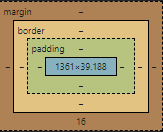
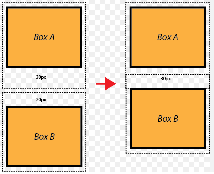
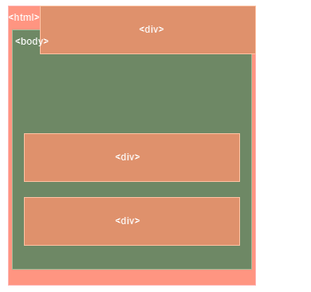

# Box Model

ogni elemnto in css è interpretato come un box da e noi possiamo vedere questo box e le sue proprieta principali aprendo lo strumento di sviluppo



ogni elmento ha un `content` che è blu e poi ha il `padding` il `border` e il `margin`

## margin collapsing



questo è il comportamento che css ha con i margini: ovvero se ci sono 2 elementi che hanno margini e sono uno adiacente all'altro , verra considerato solo il margine piu grande! CSS Questo per far si che non ci siano troppo spazi vuoti. In generale valgono :

- Fratelli adiacenti: Quando due elementi con margini sono adiacenti, il margine maggiore tra i due viene applicato tra gli elementi.
- Genitore con figli: Il margine di un genitore può fondersi con il margine del primo e/o ultimo figlio, con il margine più grande che prevale, a meno che il genitore non abbia padding, bordo o contenuto inline.
- Elemento vuoto: Se un elemento non ha contenuto, padding, bordo o altezza, i margini superiori e inferiori si uniscono e viene applicato il margine più grande.

## height and width

come detto prima tutti gli elementi sono box.
Ci sono diversi modi in cui il browser puo calcolare la width e la height di un box.
Possiamo modificare il modo in cui calcola queste proprieta impostando la proprietà `box-sizing`.
Il valore di default è `box-sizing : content-box`, quest significa che il browser nel calcolare width e height prendera in considerazione solo il content del box, quindi `padding`, `margin` e `border` saranno aggiunti alla width e alla height calcolata !
se usiamo invece `box-sizing: border-box`, cosi il browser includera la width e il border, ma non il margin, questo, è di solito, il metodo di calcolo piu conveniente da usare.
Dato che non è il comportamento di default, ma è di fatto il piu utile, di solito abbiamo bisogno di impostarlo globalmente, per fare questo dobbiamo usare il selettore universale :

```css
* {
  box-sizing: border-box;
}
```

in questo modo ogni elemento avra questa proprietà !

## Elementi Block inline e display

### Block

- Occupano l'intera larghezza disponibile.
- Iniziano su una nuova riga.
- Possono contenere sia altri elementi block che inline.

- **Esempi**: `<div>` `<p>` `<h1>` `<h2>` `<h3>` `<ul>` `<ol>` `<li>`

```html
<div>Questo è un elemento di blocco.</div>
<p>Questo è un paragrafo.</p>
<h1>Questo è un'intestazione.</h1>
```

### Inline

- Occupano solo lo spazio necessario al loro contenuto.
- Non iniziano su una nuova riga.
- Possono contenere solo altri elementi inline o testo.

- **Esempi**: `<a>` `<span>` `<strong>`, `<em>` ``, `<code>`

```html
<p>Questo è un paragrafo con un <a href="#">link</a> e del testo <strong>in grassetto</strong>.</p>
<p>Un'altra frase con del codice inline: <code>console.log('Hello World!')</code>.</p>
```

---

### Differenze Principali

| **Caratteristica**           | **Elementi Block**                    | **Elementi Inline**                           |
| ---------------------------- | ------------------------------------- | --------------------------------------------- |
| **Occupazione di spazio**    | Occupa l'intera larghezza disponibile | Occupa solo lo spazio necessario al contenuto |
| **Inizio su una nuova riga** | Sì                                    | No                                            |
| **Contenuto consentito**     | Può contenere block e inline          | Può contenere solo inline o testo             |
| **Esempi**                   | `<div>`, `<p>`, `<h1>`, `<ul>`        | `<a>`, `<span>`, `<strong>`, ``          |

### display

la Proprietà display di un elemnto è quella che ci permette di cambiare comportamento di un elemento block o inline

### Valori principali di `display`

1. **`block`**

   - L'elemento diventa un **block element**, occupa tutta la larghezza disponibile e inizia su una nuova riga.
   - Esempi: `<div>`, `<p>`, `<h1>`

2. **`inline`**

   - L'elemento diventa un **inline element**, occupa solo lo spazio necessario e rimane sulla stessa riga.
   - Esempi: `<span>`, `<a>`, `<strong>`

3. **`inline-block`**

   - Comporta l'elemento come un mix tra inline e block, permettendo di definire larghezza e altezza, ma rimanendo inline.
   - Esempio: Utilizzato per pulsanti o immagini in linea.

4. **`none`**

   - Nasconde completamente l'elemento, che non occupa spazio nel layout.
   - Esempio: Utile per menu o modali nascosti.

5. **`flex`**

   - Imposta l'elemento come un **contenitore flessibile** usando il modello di layout flexbox.
   - Esempio: Utilizzato per creare layout flessibili.

6. **`inline-flex`**

   - Simile a `flex`, ma l'elemento rimane inline, con i contenuti gestiti in modalità flessibile.

7. **`grid`**

   - Imposta l'elemento come un **contenitore a griglia**, con righe e colonne.
   - Esempio: Layout strutturati complessi.

8. **`inline-grid`**

   - Simile a `grid`, ma il contenitore principale resta inline.

9. **`table`**

   - Comporta l'elemento come una **tabella HTML**, con layout simile alle tabelle standard.
   - Esempio: Simulazione di tabelle senza `<table>`.

10. **`list-item`**

- L'elemento si comporta come un **elemento di lista** (`<li>`), con marker predefiniti (punti o numeri).
- Esempio: Usato per creare liste personalizzate.

We had a look at `display: none`
this value removes the element to which you apply it from the document flow. This means that the element is not visible and it also doesn't "block its position". Other elements can (and will) take its place instead.

There is an alternative to that though.

If you only want to hide an element but you want to keep its place (i.e. other elements don't fill the empty spot), you can use

`visibility: hidden`

---

# pseudo classi

permettono di definire lo stile di un elemento durante degli stati 'speciali'
di quello stesso elemento:
vengono aggiunte tramite l'operatore `:`

```css
a:hover {
  color: blue;
}
```

**altre pseudo classi**

1. **`:hover`**

   - Applica uno stile quando il cursore è sopra l'elemento.
   - _Esempio_: `a:hover { color: red; }`

2. **`:active`**

   - Applica uno stile mentre l'elemento è attivamente selezionato (es. clic).
   - _Esempio_: `button:active { background-color: blue; }`

3. **`:focus`**

   - Applica uno stile quando un elemento ha il focus.
   - _Esempio_: `input:focus { border: 2px solid green; }`

4. **`:visited`**

   - Stile per i link già visitati.
   - _Esempio_: `a:visited { color: purple; }`

5. **`:first-child`**

   - Seleziona il primo figlio di un elemento.
   - _Esempio_: `p:first-child { font-weight: bold; }`

6. **`:last-child`**

   - Seleziona l'ultimo figlio di un elemento.
   - _Esempio_: `li:last-child { margin-bottom: 0; }`

7. **`:nth-child(n)`**

   - Seleziona un elemento in base alla sua posizione.
   - _Esempio_: `li:nth-child(2n) { background-color: lightgrey; }`

8. **`:not(selector)`**

   - Seleziona un elemento che non corrisponde al selettore specificato.
   - _Esempio_: `div:not(.active) { opacity: 0.5; }`

9. **`:checked`**

   - Seleziona input (checkbox o radio) selezionati.
   - _Esempio_: `input[type="checkbox"]:checked { background-color: yellow; }`

10. **`:disabled`**

    - Seleziona input disabilitati.
    - _Esempio_: `input:disabled { background-color: grey; }`

11. **`:enabled`**

    - Seleziona input abilitati.
    - _Esempio_: `input:enabled { background-color: white; }`

12. **`:first-of-type`**

    - Seleziona il primo elemento del suo tipo in un genitore.
    - _Esempio_: `p:first-of-type { color: blue; }`

13. **`:last-of-type`**

    - Seleziona l'ultimo elemento del suo tipo in un genitore.
    - _Esempio_: `h2:last-of-type { color: red; }`

14. **`:nth-of-type(n)`**

    - Seleziona un elemento in base alla sua posizione tra elementi dello stesso tipo.
    - _Esempio_: `li:nth-of-type(2n) { background-color: lightblue; }`

15. **`:lang(language)`**

    - Seleziona elementi in base alla lingua specificata.
    - _Esempio_: `p:lang(en) { font-style: italic; }`

## pseudo elementi

- **pseudo elementi**
  permettono di definire lo stile di una specifica parte di un elemento.
  vengono aggiunte tramite l'operatore `: : `

  ```css
  p::first-line {
    color: blue;
  }
  ```

**altri pseudo elementi**

1. **`::before`**

   - Inserisce contenuto prima del contenuto dell'elemento.
   - _Esempio_:
     ```css
     p::before {
       content: 'Nota: ';
       font-weight: bold;
     }
     ```

2. **`::after`**

   - Inserisce contenuto dopo il contenuto dell'elemento.
   - _Esempio_:
     ```css
     p::after {
       content: ' [fine]';
     }
     ```

3. **`::first-line`**

   - Seleziona la prima riga di un blocco di testo per applicare stili specifici.
   - _Esempio_:
     ```css
     p::first-line {
       font-weight: bold;
     }
     ```

4. **`::first-letter`**

   - Seleziona la prima lettera di un blocco di testo per stili decorativi.
   - _Esempio_:
     ```css
     p::first-letter {
       font-size: 2em;
     }
     ```

5. **`::selection`**

   - Applica stili al testo selezionato dall'utente.
   - _Esempio_:
     ```css
     ::selection {
       background: yellow;
       color: black;
     }
     ```

6. **`::placeholder`**

   - Seleziona il testo segnaposto all'interno di un campo di input.
   - _Esempio_:
     ```css
     input::placeholder {
       color: grey;
       font-style: italic;
     }
     ```

7. **`::marker`**
   - Seleziona il marker di un elemento di lista (come i punti di un `<ul>`).
   - _Esempio_:
     ```css
     li::marker {
       color: red;
       font-weight: bold;
     }
     ```

<br  >

# position

come gia sappiamo il flusso del documento va dall'alto verso il basso, e se posizioniamo degli elementi nel documento questi si allineeranno dall'alto verso il basso seguendo il flusso del documento stesso.

ad esempio una pagina con la seguente struttura :

```html
<html>
  <body>
    <div></div>
    <div></div>
    <div></div>
  </body>
</html>
```

avra una forma del tipo :

.png>)

Tutto questo succede perche il browser di default apllica la proprieta `position : static`

ma immaginiano di volere una situazione atipica



dobbiamo notare 2 cose ! la posizione del div è cambiata ma le sue dimensioni e tutto il resto è rimasta la stessa !

questo perche **non** abbiamo alterato il flusso del documento, ovvero la struttura dell'html è rimasta la stesa di cui sopra.
quindi le dimensioni del div vengono ancora calcolate in relazione al suo `parent`

Fare una cosa del genere è assolutamente poss
specificare un valore diverso da `static` per
`position` per il div che vogliamo spostare !

per spostare il div all'interno del documento abbiamo le proprietà

- `left`
- `right`
- `top`
- `bottom`

con queste proprietà viene modificata la posizione dell'elemento nel flusso del documento, ma rispetto a cosa ?

ad esempio se specifico `top 20px` quei 20 pixel di distanza rispetto a cosa verranno applicati ?

ci sono diverse opzioni :

- rispetto al parent
- rispetto al viewport
- rispetto al body
- rispetto a qualsiasi altro elemtno

queste ozioni si riferiscono al `positioning context`

ibile ma bisogna la proprieta
